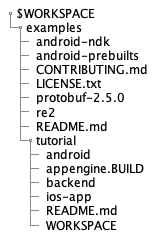
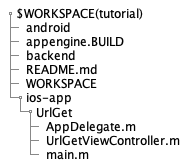
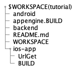
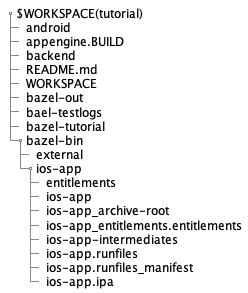
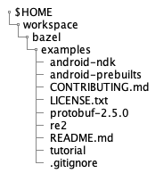
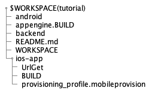

# 注意!  
この文書は以下のbazelbuild/bazelレポジトリを雰囲気で訳して図を追加したものです．  
[https://github.com/bazelbuild/bazel/blob/master/site/docs/tutorial/ios-app.md](https://github.com/bazelbuild/bazel/blob/master/site/docs/tutorial/ios-app.md)  

# BazelからiOS Appを構築する手順の紹介[2020年版]

このチュートリアルでは，単純なiOS appの構築方法を紹介します. 
このチュートリアルを終える頃にはあなたは以下のことを行うようになるでしょう．

* ToC
{:toc}


## 環境構築

BazelとXcodeをインストールし，sample projectをGitHubからクローンしてください．

### Bazelのインストール

Bazelのインストールは以下のURLを参考にしてください．  
[https://github.com/bazelbuild/bazel/blob/master/site/docs/install.md](https://github.com/bazelbuild/bazel/blob/master/site/docs/install.md)

### XCodeのインストール

以下のURLからXCodeをDLしてインストールしてください．  
[https://developer.apple.com/xcode/downloads/](https://developer.apple.com/xcode/downloads/).  
XCodeはAppleのアプリをビルドするためのコンパイラやSDK，bazelに必要なその他のツールが含まれています．

### サンプルプロジェクトのクローン

作業したいディレクトリに移動してGitHubからチュートリアルのためのサンプルプロジェクトをクローンしてください．  

```bash
cd $HOME
cd workspace/bazel #任意，今回はworkspace/bazel
git clone -b source-only https://github.com/bazelbuild/examples
```  
このクローンしたリポジトリには本来`source-only`と`master`の2種類のブランチがあります．  
`source-only`ブランチはビルド前のファイルのみで構成されています．今回のチュートリアルではこちらのブランチを使います．  
`master`ブランチはBazelに用いる`WORKSPACE`と`BUILD`ファイルを含んでおり，チュートリアル作業中にエラーが発生した時に比較して原因を突き止める手掛かりになります．  
以下のURLに`master`ブランチのリンクを示します．  
[https://github.com/bazelbuild/examples/tree/master/tutorial](https://github.com/bazelbuild/examples/tree/master/tutorial)  

`git clone`コマンドから入手したディレクトリは$HOME/workspace/bazel/examplesになっています．  
このディレクトリにはBazelのためのいくつかのプロジェクト(iOSだけでなくandroidなども)が含まれます．  
今回のチュートリアルでは，`$HOME/workspace/bazel/examples/tutorial/ios-app`が対象となっています．

## workspaceのセットアップ

現在の作業ディレクトリには1種以上のソフトウェアプロジェクトが含まれています．また，バゼルがソフトウェアをビルドするために使用するコードは`WORKSPACE`ファイルと`BUILD`ファイルの二種類から構成されています．今回の作業ディレクトリは`$HOME/workspace/bazel/examples/tutorial`です．  
このディレクトリ上に次項で，`WORKSPACE`ファイルを作成します．また，`$HOME/workspace/bazel/examples/tutorial`の入力をいちいちするのが面倒な場合は，以下のコマンドで`$WORKSPACE`に置換することができます．

```bash
export WORKSPACE=$HOME/workspace/bazel/examples/tutorial
```

### WORKSPACE ファイルの作成

作業ディレクトリごとに`WORKSPACE`ファイルを作業ディレクトリのルートに生成しなければなりません．このファイルは空かソフトウェアをビルドするための外部の依存関係を含むかもしれません．  

さて，`WORKSPACE`ファイルを作っていきましょう． 以下のコマンドを入力してください．(open XCodeコマンドが実行できなかった場合は直接ディレクトリから開くのも可)  
以下のコマンドを入力することで`$WORKSPACE`直下に`WORKSPACE`ファイルを配置し，XCodeで開きます．

```bash
touch $WORKSPACE/WORKSPACE
open -a Xcode $WORKSPACE/WORKSPACE
```

以下に現在のディレクトリの画像を示します．  


### WORKSPACEファイルの記述

Appleデバイスのアプリケーションをビルドするために,BazelはGitHubから最新の[Apple build rules](https://github.com/bazelbuild/rules_apple)
をpullする必要があります．これを可能にするためには以下のように記述することで解決します．  
`WORKSPACE`ファイルに以下の行を追加してください．

```
load("@bazel_tools//tools/build_defs/repo:git.bzl", "git_repository")
git_repository(
    name = "build_bazel_rules_apple",
    remote = "https://github.com/bazelbuild/rules_apple.git",
    tag = "0.19.0",
)
git_repository(
    name = "build_bazel_rules_swift",
    remote = "https://github.com/bazelbuild/rules_swift.git",
	tag = "0.13.0",
)

git_repository(
    name = "build_bazel_apple_support",
    remote = "https://github.com/bazelbuild/apple_support.git",
	tag = "0.7.2",
)

git_repository(
    name = "bazel_skylib",
    remote = "https://github.com/bazelbuild/bazel-skylib.git",
    tag = "0.9.0",
)
```

**メモ:** "常にコード内の`tag`属性は[最新のapple rules](https://github.com/bazelbuild/rules_apple/releases)にしておいてください．また，コード内の`rules_apple`の依存関係で要求される属性は[こちら](https://github.com/bazelbuild/rules_apple)です"  

**メモ:** "コード内の`build_bazel_rules_apple`の`git_repository`にて**必ず**`name`属性に値を入れてください．値がなければビルドが失敗します．"

## 今回ビルドするソースファイルについて
今回のチュートリアルでは`WORKSPACE/ios-app/UrlGet`内のソースコードをビルドします．現状では3種類のソースコードがあることを確認してください．また今回のチュートリアルではこれらのソースコードは編集しません．以下に`$WORKSPACE`から見た`UrlGet`内の階層構造を示します．  


## BUILDファイルの作成

コマンドラインプロンプトから新しい`BUILD`ファイルを開いて作成してください．

```bash
touch $WORKSPACE/ios-app/BUILD
open -a Xcode $WORKSPACE/ios-app/BUILD
```

以下に`$WORKSPACE`から見た`BUILD`ファイルの階層構造を示します．   


### BUILDファイルにどのデバイスのルールでビルドするのかを決定する宣言を追加

iOSをビルドするために，BazelはGitHubリポジトリからビルドして実行できるかを調べるbuild rurlesをロードする必要があります．以下の行を`BUILD`ファイルに追加してください．

```
load("@build_bazel_rules_apple//apple:ios.bzl", "ios_application")
```

今回は`iOS_application`ruleだけをロードします．なぜなら，後ほど登場する`objc_library`ルールはBazel packageに予め存在しているためです．

### objc_library ruleの追加

Bazelでは，iOSプラットフォームをビルドするために使うことができるいくつかのビルドルールが存在します．このチュートリアルでは，最初に`objc_library`ruleを使って，アプリのソースコードやXibファイルから静的なライブラリをビルドする方法を伝えます．それから，`ios_application`ルールを使って，アプリのバイナリや`.ipa`bundleのビルド方法について紹介します．  

**メモ:** このチュートリアルは最小限のBazelのObjective-Cのrulesのケースを使います．例えば，あなたが，iOSアプリをmulti-architectureでビルドするためには`[iOS_application](https://github.com/bazelbuild/rules_apple/tree/master/doc)`ruleを使わなければなりません．

以下のコードを`BUILD`ファイルの末尾に追加してください．

```python
objc_library(
    name = "UrlGetClasses",
    srcs = [
         "UrlGet/AppDelegate.m",
         "UrlGet/UrlGetViewController.m",
         "UrlGet/main.m",
    ],
    hdrs = glob(["UrlGet/*.h"]),
    data = ["UrlGet/UrlGetViewController.xib"],
)
```

ここでは，ruleのnameをUrlGetClassesに設定しました．

### ios_application ruleの追加

`ios_application`ruleはapplication binaryのビルドと，'.ipa'bundle ファイルを作成します．

`BUILD`ファイルの末尾に以下の行を追加してください

```python
ios_application(
    name = "ios-app",
    bundle_id = "Google.UrlGet",
    families = [
        "iphone",
        "ipad",
    ],
    minimum_os_version = "9.0",
    infoplists = [":UrlGet/UrlGet-Info.plist"],
    visibility = ["//visibility:public"],
    deps = [":UrlGetClasses"],
)
```

**メモ:** コード内の`minimum_os_version`属性はあなたがサポートするiOSのバージョンにアップデートしておいてください．  

コード内の`deps`属性は先ほど，`objc_library`rule内の`name`で宣言した値である`UrlGetClasses`を参照します．  

さて，`WORKSPACE`と`BUILD`ファイルを保存して閉じてください．今作った`BUILD`ファイルはGitHubリポジトリの[completed example](https://github.com/bazelbuild/examples/blob/master/tutorial/ios-app/BUILD)の`master`ブランチで比較することができます．

## アプリケーションをビルドしてデプロイしよう

iOSデバイスのシミュレータ上でのビルドとデプロイの準備が整いました．

**メモ:** アプリケーションをスタンドアロンで実行できますが，出力するためのbackend サーバが必要です．backend serverをビルドするための sample project directryからREADME ファイルを確認してください．

### シミュレータのためのアプリケーションをビルド

以下のコマンドで`$WORKSPACE`に移動してください

```bash
cd $WORKSPACE
```

sampleアプリケーションをビルドするために以下のコマンドを実行してください．

```bash
bazel build //ios-app:ios-app
```

Bazelが作動して，sampleアプリケーションをビルドします．ビルド中は以下のような出力が現れます．

```bash
INFO: Found 1 target...
Target //ios-app:ios-app up-to-date:
  bazel-bin/ios-app/ios-app.ipa
INFO: Elapsed time: 0.565s, Critical Path: 0.44s
```

### 出力されたファイルを見つける

`.ipa`ファイルとそれ以外の出力が`$WORKSPACE/bazel-bin/ios-app`ディレクトリに位置付けられます．  
以下に`$WORKSPACE`から見た`.ipa`の階層構造を示します．  



### シミュレータを用いたアプリケーションの実行とデバッグ

iOSシミュレータを用いてXcodeからアプリケーションを実行できます．最初に[Tulsiを使ったXcode project]((http://tulsi.bazel.io/)を生成します．  
それから,Xcodeを開いて，runtime schemeとしてiOSSimulatorを選択します．そして，Runを選択します．

**メモ:** Xcod内のプロジェクトを修正するなら，(例えば，ファイルを追加したり削除したなら，もしくは依存関係を追加変更したなら)再度Bazelを使ってアプリケーションを再ビルドしなければなりません．それに加えて，TulsiのXcode projectを作り直したり，Xcodeを開き直す必要もあります．

### デバイスにおけるアプリケーションのビルド

iOSデバイスをインストールして実行するためのアプリケーションのビルドには，Bazelはデバイスモデルの適切なprovisioning profileが必要です．  
以下にprovision profileの入手手順について示します．

1. [Apple Developer Account](https://developer.apple.com/account)にアクセスして，あなたのデバイスにあったprovisioning profileをダウンロードしてください．さらに情報を知りたければ[Apple's documentation](https://developer.apple.com/library/ios/documentation/IDEs/Conceptual/AppDistributionGuide/MaintainingProfiles/MaintainingProfiles.html)をご覧ください．  

2. ダウンロードしたprofileを`$WORKSPACE`にコピペしてください．  

3. (選択) `.gitignore`ファイルを作成して，ダウンロードしたprofileを`.gitignore`に以下のように記述してください．

   ```
   *.mobileprovision
   ```
   
   以下に`$HOME`から見た`.gitignore`の階層を示します．  
   
   
4. `BUILD`ファイル内の`ios_application`内に以下の行を追加してください．  
   また，`<your_profile_name>`にはダウンロードしたprofileの名前に置き換えてください．

   ```python
   provisioning_profile = "<your_profile_name>.mobileprovision",
   ```
   
   ダウンロードしたprofileの名前がprovisioning_profile.mobileprovisionの場合は以下のように記述します．
   
   ```python
   provisioning_profile = "provisioning_profile.mobileprovision",
   ```
   また，`$WORKSPACE`から見た`provisioning_profile.mobileprovision`の階層を示します．  
   
   
   **メモ:**  デバイスにインストールしたアプリとprofileが正しいことを確認しておいてください．

さて，アプリケーションをデバイスにビルドしましょう

```bash
bazel build //ios-app:ios-app --ios_multi_cpus=armv7,arm64
```

このコマンドは，fat binaryとしてアプリケーションをビルドします．  
痩せるためには，特定のデバイスのアーキテクチャとしてビルドするために，build optionsを指定する必要があります．

特定のXcodeのバージョンでビルドするために，`--xcode_version`optionが利用できます．  
また，特定のSDKバージョンを利用する場合は`--ios_sdk_version`optionを利用してください．  
`--xcode_version`optionは多くの場合に用いられる可能性があります．

最小のiOSバージョンを指定するために，`minimum_os_version`を`BUILD`ファイル内の`ios_application`のパラメータとして設定しておいてください．

コマンドラインよりもむしろGUIを使ってアプリケーションをビルドしたい場合は，[Tulsi]((http://tulsi.bazel.io/docs/gettingstarted.html)を利用することができます．

### デバイス上でのアプリケーションのインストール

デバイスのアプリケーションをインストールするための最も簡単な方法は，Xcodeを起動して，  
`Windows > Devices`から左のリストの使用するデバイスを選択し，**Add**(+マーク)をクリックして，  
下の"Installed Apps"と`selecting the`から先程作成した`.ipa`ファイルを選択してください．  
再度，以下に`$WORKSPACE`から見た`.ipa`の階層構造を示します．  


もし，デバイスにアプリケーションのインストールが失敗したら,`BUILD`ファイル内のprovisioning profileが正しいかを確認してください．  

もし，アプリケーションの開始が失敗したら，provisioning profileの一部に原因がある可能性があります．  
Xcode内の画面で，`Device`ボタンをクリックして`View Device Logs`から，エラーの手掛かりが掴めるかもしれません．

## このチュートリアルのまとめ

このチュートリアルでは，iOSアプリケーションをビルドするためにBazelを使いました．そして，以下のことを成し遂げました．  

*   Set up your environment by installing Bazel and Xcode, and downloading the
    sample project
*   Set up a Bazel [workspace](workspace.md) that contained the source code
    for the app and a `WORKSPACE` file that identifies the top level of the
    workspace directory
*   Updated the `WORKSPACE` file to contain references to the required
    external dependencies
*   Created a `BUILD` file
*   Ran Bazel to build the app for the simulator and an iOS device
*   Ran the app in the simulator and on an iOS device

The built app is located in the `$WORKSPACE/bazel-bin` directory.

Completed `WORKSPACE` and `BUILD` files for this tutorial are located in the
[master branch](https://github.com/bazelbuild/examples/tree/master/tutorial)
of the GitHub repo. You can compare your work to the completed files for
additional help or troubleshooting.
