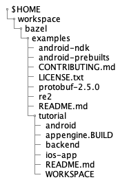

# 注意!  
この文書は以下のbazelbuild/bazelレポジトリを雰囲気で訳して図を追加したものです．  
[https://github.com/bazelbuild/bazel/blob/master/site/docs/tutorial/ios-app.md](https://github.com/bazelbuild/bazel/blob/master/site/docs/tutorial/ios-app.md)  

# BazelからiOS Appを構築する手順の紹介[2020年版]

このチュートリアルでは，単純なiOS appの構築方法を紹介します. 
このチュートリアルを終える頃にはあなたは以下のことを行うようになるでしょう．

* ToC
{:toc}


## 環境構築

BazelとXcodeをインストールし，sample projectをGitHubからクローンしてください．

### Bazelのインストール

Bazelのインストールは以下のURLを参考にしてください．  
[https://github.com/bazelbuild/bazel/blob/master/site/docs/install.md](https://github.com/bazelbuild/bazel/blob/master/site/docs/install.md)

### XCodeのインストール

以下のURLからXCodeをDLしてインストールしてください．  
[https://developer.apple.com/xcode/downloads/](https://developer.apple.com/xcode/downloads/).  
XCodeはAppleのアプリをビルドするためのコンパイラやSDK，bazelに必要なその他のツールが含まれています．

### サンプルプロジェクトのクローン

作業したいディレクトリに移動してGitHubからチュートリアルのためのサンプルプロジェクトをクローンしてください．  

```bash
cd $HOME
cd workspace/bazel #任意，今回はworkspace/bazel
git clone -b source-only https://github.com/bazelbuild/examples
```  
このクローンしたリポジトリには本来`source-only`と`master`の2種類のブランチがあります．  
`source-only`ブランチはビルド前のファイルのみで構成されています．今回のチュートリアルではこちらのブランチを使います．  
`master`ブランチはBazelに用いる`WORKSPACE`と`BUILD`ファイルを含んでおり，チュートリアル作業中にエラーが発生した時に比較して原因を突き止める手掛かりになります．  
以下のURLに`master`ブランチのリンクを示します．  
[https://github.com/bazelbuild/examples/tree/master/tutorial](https://github.com/bazelbuild/examples/tree/master/tutorial)  

`git clone`コマンドから入手したディレクトリは$HOME/workspace/bazel/examplesになっています．  
このディレクトリにはBazelのためのいくつかのプロジェクト(iOSだけでなくandroidなども)が含まれます．  
今回のチュートリアルでは，`$HOME/workspace/bazel/examples/tutorial/ios-app`が対象となっています．

## workspaceのセットアップ

現在の作業ディレクトリには1種以上のソフトウェアプロジェクトが含まれています．また，バゼルがソフトウェアをビルドするために使用するコードは`WORKSPACE`ファイルと`BUILD`ファイルの二種類から構成されています．今回の作業ディレクトリは`$HOME/workspace/bazel/examples/tutorial`です．  
このディレクトリ上に次項で，`WORKSPACE`ファイルを作成します．また，`$HOME/workspace/bazel/examples/tutorial`の入力をいちいちするのが面倒な場合は，以下のコマンドで`$WORKSPACE`に置換することができます．

```bash
export WORKSPACE=$HOME/workspace/bazel/examples/tutorial
```

### WORKSPACE ファイルの作成

作業ディレクトリごとに`WORKSPACE`ファイルを作業ディレクトリのルートに生成しなければなりません．このファイルは空かソフトウェアをビルドするための外部の依存関係を含むかもしれません．  

さて，`WORKSPACE`ファイルを作っていきましょう． 以下のコマンドを入力してください．(open XCodeコマンドが実行できなかった場合は直接ディレクトリから開くのも可)  
以下のコマンドを入力することで`$WORKSPACE`直下に`WORKSPACE`ファイルを配置し，XCodeで開きます．

```bash
touch $WORKSPACE/WORKSPACE
open -a Xcode $WORKSPACE/WORKSPACE
```

以下に現在のディレクトリの画像を示します．  


### WORKSPACEファイルの記述

Appleデバイスのアプリケーションをビルドするために,BazelはGitHubから最新の[Apple build rules](https://github.com/bazelbuild/rules_apple)
をpullする必要があります．これを可能にするためには以下のように記述することで解決します．  
`WORKSPACE`ファイルに以下の行を追加してください．

```
load("@bazel_tools//tools/build_defs/repo:git.bzl", "git_repository")
git_repository(
    name = "build_bazel_rules_apple",
    remote = "https://github.com/bazelbuild/rules_apple.git",
    tag = "0.19.0",
)
git_repository(
    name = "build_bazel_rules_swift",
    remote = "https://github.com/bazelbuild/rules_swift.git",
	tag = "0.13.0",
)

git_repository(
    name = "build_bazel_apple_support",
    remote = "https://github.com/bazelbuild/apple_support.git",
	tag = "0.7.2",
)

git_repository(
    name = "bazel_skylib",
    remote = "https://github.com/bazelbuild/bazel-skylib.git",
    tag = "0.9.0",
)
```

**メモ:** "常にコード内の`tag`属性は[最新のapple rules](https://github.com/bazelbuild/rules_apple/releases)にしておいてください．また，コード内の`rules_apple`の依存関係で要求される属性は[こちら](https://github.com/bazelbuild/rules_apple)です"  

**メモ:** "コード内の`build_bazel_rules_apple`の`git_repository`にて**必ず**`name`属性に値を入れてください．値がなければビルドが失敗します．"

## 今回ビルドするソースファイルについて
今回のチュートリアルでは`WORKSPACE/ios-app/UrlGet`内のソースコードをビルドします．現状では3種類のソースコードがあることを確認してください．また今回のチュートリアルではこれらのソースコードは編集しません．以下にWORKSPACEから見たUrlGet内の階層構造を示します．  


## BUILDファイルの作成

コマンドラインプロンプトから新しい`BUILD`ファイルを開いて作成してください．

```bash
touch $WORKSPACE/ios-app/BUILD
open -a Xcode $WORKSPACE/ios-app/BUILD
```

### BUILDファイルにどのデバイスのルールでビルドするのかを決定する宣言を追加

iOSをビルドするために，BazelはGitHubリポジトリからビルドして実行できるかを調べるbuild rurlesをロードする必要があります．以下の行を`BUILD`ファイルに追加してください．

```
load("@build_bazel_rules_apple//apple:ios.bzl", "ios_application")
```

今回は`iOS_application`ruleだけをロードします．なぜなら，後ほど登場する`objc_library`ルールはBazel packageに予め存在しているためです．

### objc_library ruleの追加

Bazelでは，iOSプラットフォームをビルドするために使うことができるいくつかのビルドルールが存在します．このチュートリアルでは，最初に`objc_library`ruleを使って，アプリのソースコードやXibファイルから静的なライブラリをビルドする方法を伝えます．それから，`ios_application`ルールを使って，アプリのバイナリや`.ipa`bundleのビルド方法について紹介します．  

**メモ:** このチュートリアルは最小限のBazelのObjective-Cのrulesのケースを使います．例えば，あなたが，iOSアプリをmulti-architectureでビルドするためには`[iOS_application](https://github.com/bazelbuild/rules_apple/tree/master/doc)`ruleを使わなければなりません．

以下のコードを`BUILD`ファイルの末尾に追加してください．

```python
objc_library(
    name = "UrlGetClasses",
    srcs = [
         "UrlGet/AppDelegate.m",
         "UrlGet/UrlGetViewController.m",
         "UrlGet/main.m",
    ],
    hdrs = glob(["UrlGet/*.h"]),
    data = ["UrlGet/UrlGetViewController.xib"],
)
```

ここでは，ruleのnameをUrlGetClassesに設定しました．

### ios_application ruleの追加

`ios_application`ruleはapplication binaryのビルドと，'.ipa'bundle ファイルの作成です．

[`ios_application`](https://github.com/bazelbuild/rules_apple/tree/master/doc)
rule builds the application binary and creates the `.ipa` bundle file.

Add the following to your `BUILD` file:

```python
ios_application(
    name = "ios-app",
    bundle_id = "Google.UrlGet",
    families = [
        "iphone",
        "ipad",
    ],
    minimum_os_version = "9.0",
    infoplists = [":UrlGet/UrlGet-Info.plist"],
    visibility = ["//visibility:public"],
    deps = [":UrlGetClasses"],
)
```

**NOTE:** Please update the `minimum_os_version` attribute to the minimum
version of iOS that you plan to support.

Note how the `deps` attribute references the output of the `UrlGetClasses` rule
you added to the `BUILD` file above.

Now, save and close the file. You can compare your `BUILD` file to the
[completed example](https://github.com/bazelbuild/examples/blob/master/tutorial/ios-app/BUILD)
in the `master` branch of the GitHub repo.

## Build and deploy the app

You are now ready to build your app and deploy it to a simulator and onto an
iOS device.

**NOTE:** The app launches standalone but requires a backend server in order to
produce output. See the README file in the sample project directory to find out
how to build the backend server.

### Build the app for the simulator

Make sure that your current working directory is inside your Bazel workspace:

```bash
cd $WORKSPACE
```

Now, enter the following to build the sample app:

```bash
bazel build //ios-app:ios-app
```

Bazel launches and builds the sample app. During the build process, its
output will appear similar to the following:

```bash
INFO: Found 1 target...
Target //ios-app:ios-app up-to-date:
  bazel-bin/ios-app/ios-app.ipa
INFO: Elapsed time: 0.565s, Critical Path: 0.44s
```

### Find the build outputs

The `.ipa` file and other outputs are located in the
`$WORKSPACE/bazel-bin/ios-app` directory.

### Run and debug the app in the simulator

You can now run the app from Xcode using the iOS Simulator. First, [generate an Xcode project using Tulsi](http://tulsi.bazel.io/).

Then, open the project in Xcode, choose an iOS Simulator as the runtime scheme,
and click **Run**.

**Note:** If you modify any project files in Xcode (for example, if you add or
remove a file, or add or change a dependency), you must rebuild the app using
Bazel, re-generate the Xcode project in Tulsi, and then re-open the project in
Xcode.

### Build the app for a device

To build your app so that it installs and launches on an iOS device, Bazel needs
the appropriate provisioning profile for that device model. Do the following:

1. Go to your [Apple Developer Account](https://developer.apple.com/account) and
   download the appropriate provisioning profile for your device. See
   [Apple's documentation](https://developer.apple.com/library/ios/documentation/IDEs/Conceptual/AppDistributionGuide/MaintainingProfiles/MaintainingProfiles.html)
   for more information.

2. Move your profile into `$WORKSPACE`.

3. (Optional) Add your profile to your `.gitignore` file.

4. Add the following line to the `ios_application` target in your `BUILD` file:

   ```python
   provisioning_profile = "<your_profile_name>.mobileprovision",
   ```

   **NOTE:** Ensure the profile is correct so that the app can be installed on
   a device.

Now build the app for your device:

```bash
bazel build //ios-app:ios-app --ios_multi_cpus=armv7,arm64
```

This builds the app as a fat binary. To build for a specific device
architecture, designate it in the build options.

To build for a specific Xcode version, use the `--xcode_version` option. To
build for a specific SDK version, use the `--ios_sdk_version` option. The
`--xcode_version` option is sufficient in most scenarios.

To specify a minimum required iOS version, add the `minimum_os_version`
parameter to the `ios_application` build rule in your `BUILD` file.

You can also use [Tulsi](http://tulsi.bazel.io/docs/gettingstarted.html) to
build your app using a GUI rather than the command line.

### Install the app on a device

The easiest way to install the app on the device is to launch Xcode and use the
`Windows > Devices` command. Select your plugged-in device from the list on the
left, then add the app by clicking the **Add** (plus sign) button under
"Installed Apps" and selecting the `.ipa` file that you built.

If your app fails to install on your device, ensure that you are specifying the
correct provisioning profile in your `BUILD` file (step 4 in the previous
section).

If your app fails to launch, make sure that your device is part of your
provisioning profile. The `View Device Logs` button on the `Devices` screen in
Xcode may provide other information as to what has gone wrong.

## Review your work

In this tutorial, you used Bazel to build an iOS app. To accomplish that, you:

*   Set up your environment by installing Bazel and Xcode, and downloading the
    sample project
*   Set up a Bazel [workspace](workspace.md) that contained the source code
    for the app and a `WORKSPACE` file that identifies the top level of the
    workspace directory
*   Updated the `WORKSPACE` file to contain references to the required
    external dependencies
*   Created a `BUILD` file
*   Ran Bazel to build the app for the simulator and an iOS device
*   Ran the app in the simulator and on an iOS device

The built app is located in the `$WORKSPACE/bazel-bin` directory.

Completed `WORKSPACE` and `BUILD` files for this tutorial are located in the
[master branch](https://github.com/bazelbuild/examples/tree/master/tutorial)
of the GitHub repo. You can compare your work to the completed files for
additional help or troubleshooting.
